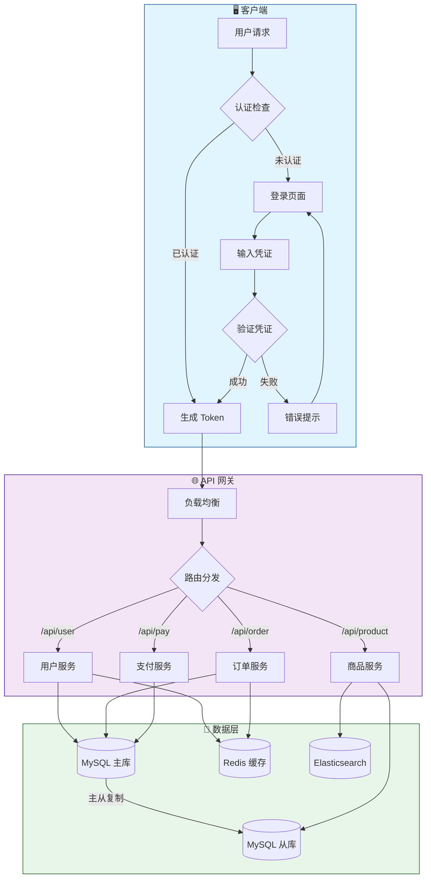
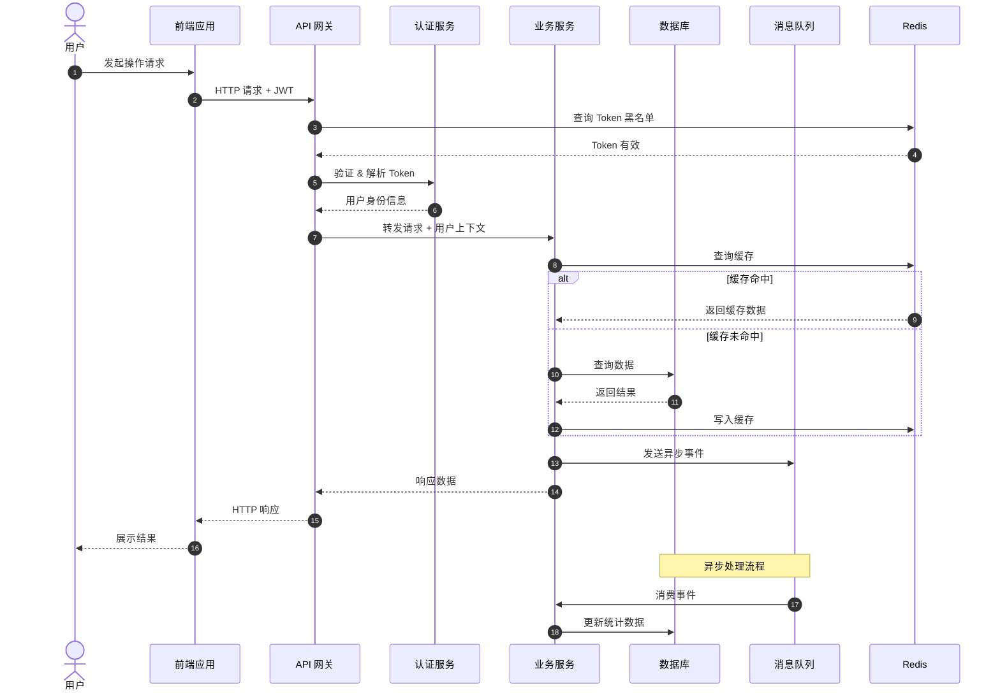
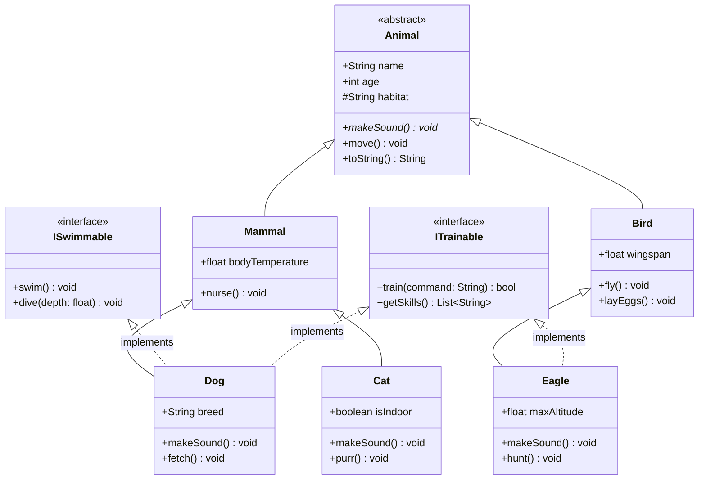
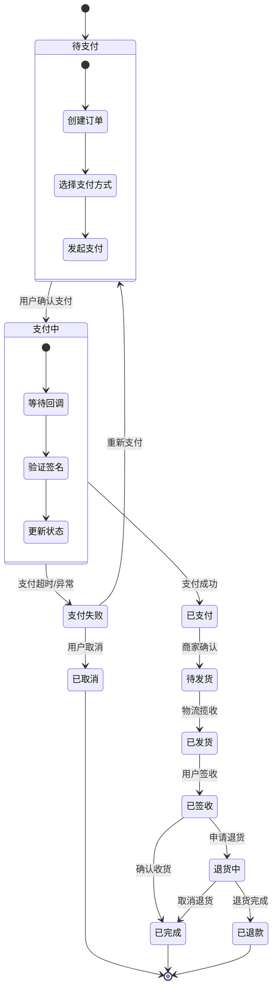
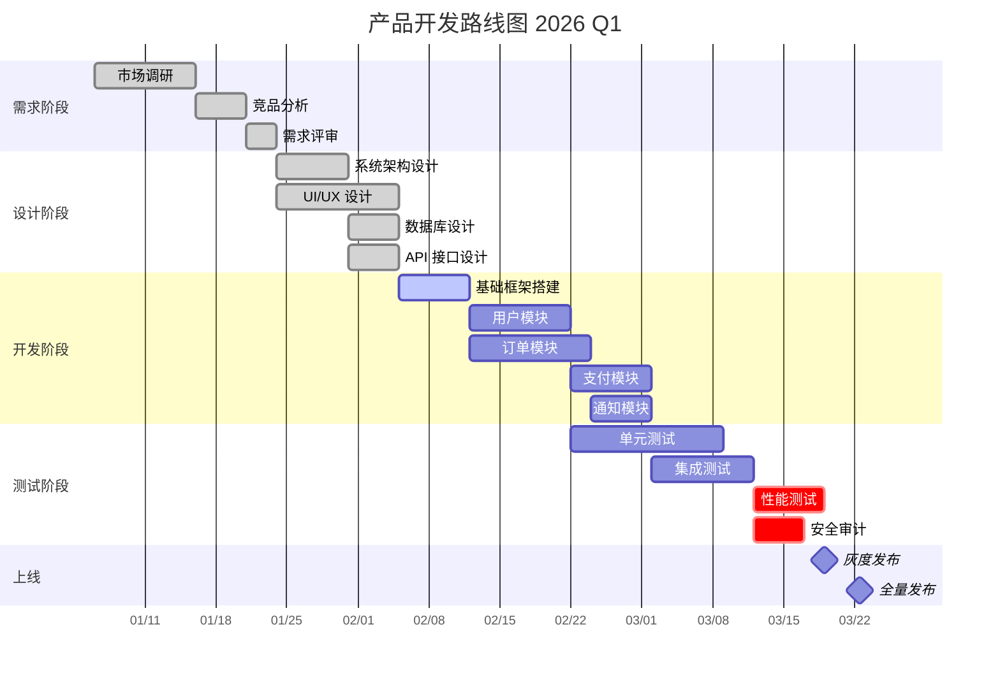
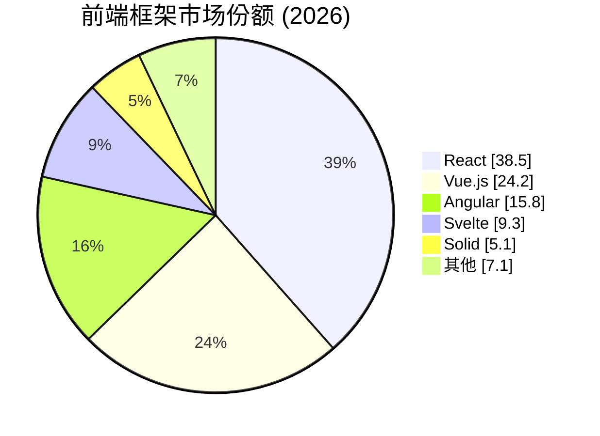
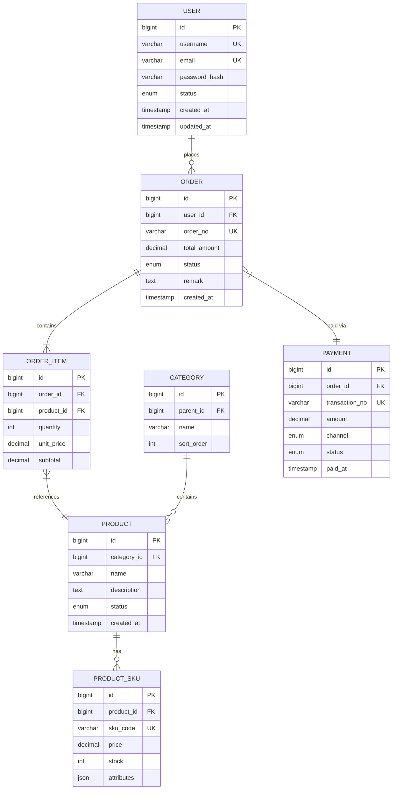
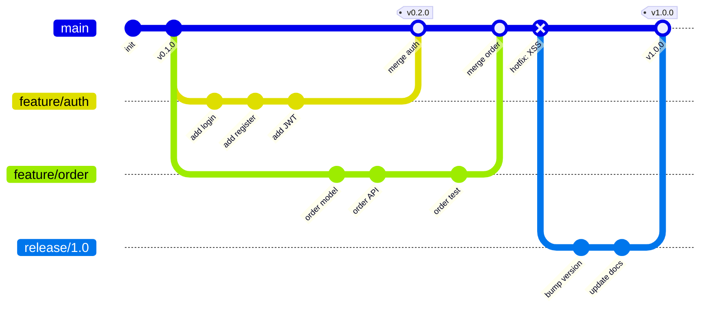
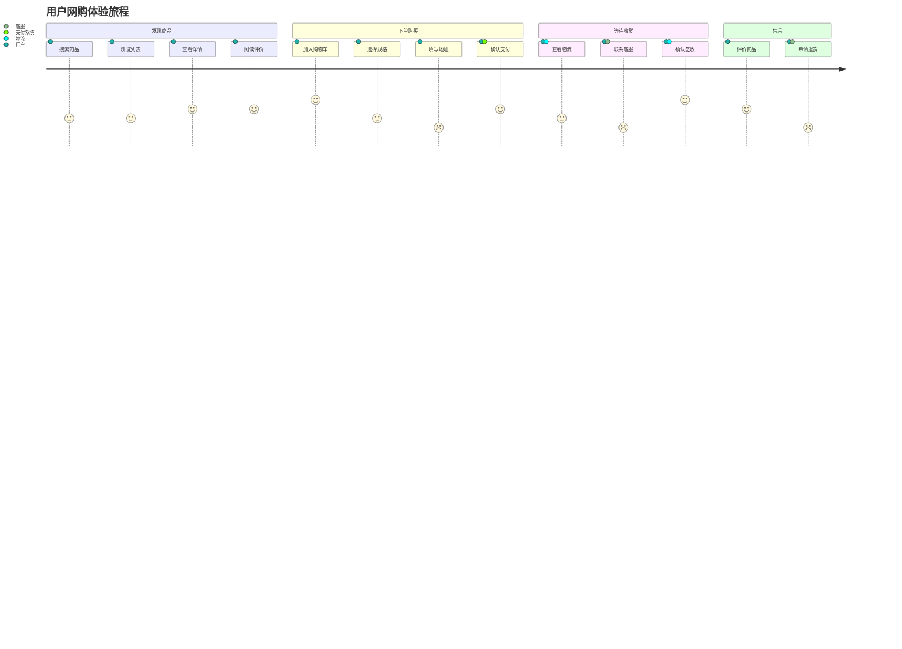
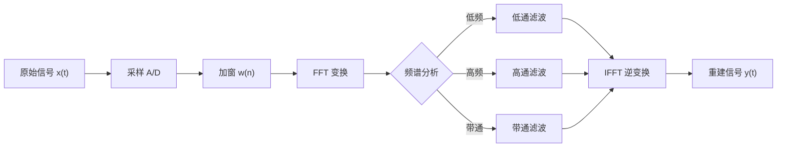

# md-glance 渲染能力测试文档

本文档包含复杂的 Mermaid 图表、LaTeX 数学公式及各类 GFM 语法，用于全面测试 Markdown 阅读器的渲染能力。

---

## 一、数学公式

### 1.1 行内公式

爱因斯坦质能方程 $E = mc^2$ 是物理学中最著名的公式之一。欧拉恒等式 $e^{i\pi} + 1 = 0$ 被誉为"最优美的数学公式"。薛定谔方程中，波函数 $\Psi(\mathbf{r}, t)$ 满足归一化条件 $\int_{-\infty}^{\infty} |\Psi|^2 \, dx = 1$。贝叶斯定理 $P(A|B) = \frac{P(B|A) \cdot P(A)}{P(B)}$ 是概率论的基石。

### 1.2 极限与微积分

$$
\lim_{n \to \infty} \left(1 + \frac{1}{n}\right)^n = e
$$

$$
\frac{d}{dx}\left[\int_{a}^{x} f(t)\,dt\right] = f(x)
$$

$$
\int_0^\infty e^{-x^2} \, dx = \frac{\sqrt{\pi}}{2}
$$

$$
\oint_C \mathbf{F} \cdot d\mathbf{r} = \iint_S (\nabla \times \mathbf{F}) \cdot d\mathbf{S}
$$

### 1.3 级数与求和

$$
\sum_{n=0}^{\infty} \frac{x^n}{n!} = e^x
$$

$$
\prod_{p \text{ prime}} \frac{1}{1 - p^{-s}} = \sum_{n=1}^{\infty} \frac{1}{n^s} = \zeta(s), \quad \Re(s) > 1
$$

$$
\sum_{k=0}^{n} \binom{n}{k} x^k y^{n-k} = (x + y)^n
$$

### 1.4 矩阵与线性代数

$$
A = \begin{pmatrix}
a_{11} & a_{12} & \cdots & a_{1n} \\
a_{21} & a_{22} & \cdots & a_{2n} \\
\vdots & \vdots & \ddots & \vdots \\
a_{m1} & a_{m2} & \cdots & a_{mn}
\end{pmatrix}
$$

$$
\det(A) = \sum_{\sigma \in S_n} \text{sgn}(\sigma) \prod_{i=1}^{n} a_{i,\sigma(i)}
$$

$$
\begin{bmatrix}
1 & 0 & 0 \\
0 & \cos\theta & -\sin\theta \\
0 & \sin\theta & \cos\theta
\end{bmatrix}
\begin{bmatrix} x \\ y \\ z \end{bmatrix}
=
\begin{bmatrix} x \\ y\cos\theta - z\sin\theta \\ y\sin\theta + z\cos\theta \end{bmatrix}
$$

### 1.5 分段函数与方程组

$$
f(x) = \begin{cases}
\displaystyle\frac{x^2 - 1}{x - 1} & \text{if } x \neq 1 \\[10pt]
2 & \text{if } x = 1
\end{cases}
$$

$$
\begin{aligned}
\nabla \cdot \mathbf{E} &= \frac{\rho}{\varepsilon_0} \\[6pt]
\nabla \cdot \mathbf{B} &= 0 \\[6pt]
\nabla \times \mathbf{E} &= -\frac{\partial \mathbf{B}}{\partial t} \\[6pt]
\nabla \times \mathbf{B} &= \mu_0 \mathbf{J} + \mu_0 \varepsilon_0 \frac{\partial \mathbf{E}}{\partial t}
\end{aligned}
$$

### 1.6 复杂嵌套公式

$$
\mathcal{L}\{f(t)\} = \int_0^{\infty} f(t) \, e^{-st} \, dt = F(s)
$$

$$
\hat{f}(\xi) = \int_{-\infty}^{\infty} f(x) \, e^{-2\pi i x \xi} \, dx
$$

$$
\cfrac{1}{1 + \cfrac{1}{2 + \cfrac{1}{3 + \cfrac{1}{4 + \cdots}}}} = \frac{e - 1}{e + 1}
$$

$$
\underbrace{\int \cdots \int}_{n} f(x_1, x_2, \ldots, x_n) \, dx_1 \, dx_2 \cdots dx_n
$$

---

## 二、Mermaid 图表

### 2.1 复杂流程图（含子图）



### 2.2 时序图



### 2.3 类图



### 2.4 状态图



### 2.5 甘特图



### 2.6 饼图



### 2.7 ER 图



### 2.8 Git 图



### 2.9 用户旅程图



---

## 三、GFM 扩展语法

### 3.1 任务列表

- [x] 支持基础 Markdown 渲染
- [x] 支持 GFM 表格
- [x] 支持代码高亮
- [x] 支持 KaTeX 数学公式
- [x] 支持 Mermaid 图表
- [ ] 支持脚注
- [ ] 支持自定义主题

### 3.2 复杂表格

| 算法 | 平均时间复杂度 | 最坏时间复杂度 | 空间复杂度 | 稳定性 |
|:---|:---:|:---:|:---:|:---:|
| 冒泡排序 | $O(n^2)$ | $O(n^2)$ | $O(1)$ | ✅ 稳定 |
| 快速排序 | $O(n \log n)$ | $O(n^2)$ | $O(\log n)$ | ❌ 不稳定 |
| 归并排序 | $O(n \log n)$ | $O(n \log n)$ | $O(n)$ | ✅ 稳定 |
| 堆排序 | $O(n \log n)$ | $O(n \log n)$ | $O(1)$ | ❌ 不稳定 |
| 计数排序 | $O(n + k)$ | $O(n + k)$ | $O(k)$ | ✅ 稳定 |
| 基数排序 | $O(nk)$ | $O(nk)$ | $O(n + k)$ | ✅ 稳定 |

### 3.3 多语言代码块

**Swift:**

```swift
protocol MarkdownRenderer {
    associatedtype Output
    func render(_ markdown: String) async throws -> Output
}

struct HTMLRenderer: MarkdownRenderer {
    typealias Output = String
    
    private let options: RenderOptions
    
    func render(_ markdown: String) async throws -> String {
        let ast = try Parser.parse(markdown)
        return ast.accept(HTMLVisitor(options: options))
    }
}

extension HTMLRenderer {
    struct RenderOptions: Sendable {
        var enableMath: Bool = true
        var enableMermaid: Bool = true
        var theme: Theme = .auto
        
        enum Theme: String, Sendable {
            case light, dark, auto
        }
    }
}
```

**Python:**

```python
from typing import TypeVar, Generic, Callable
from dataclasses import dataclass, field
from functools import reduce

T = TypeVar('T')
U = TypeVar('U')

@dataclass(frozen=True)
class Result(Generic[T]):
    value: T | None = None
    error: Exception | None = None
    
    def map(self, f: Callable[[T], U]) -> 'Result[U]':
        if self.error:
            return Result(error=self.error)
        try:
            return Result(value=f(self.value))
        except Exception as e:
            return Result(error=e)
    
    def flat_map(self, f: Callable[[T], 'Result[U]']) -> 'Result[U]':
        if self.error:
            return Result(error=self.error)
        return f(self.value)

pipeline = [
    lambda x: Result(value=x * 2),
    lambda x: Result(value=x + 10),
    lambda x: Result(value=x ** 0.5),
]

result = reduce(lambda r, f: r.flat_map(f), pipeline, Result(value=42))
```

**Rust:**

```rust
use std::sync::Arc;
use tokio::sync::RwLock;

#[derive(Debug, Clone)]
struct Cache<K: Eq + Hash, V: Clone> {
    store: Arc<RwLock<HashMap<K, (V, Instant)>>>,
    ttl: Duration,
}

impl<K: Eq + Hash + Clone, V: Clone> Cache<K, V> {
    async fn get_or_insert<F, Fut>(&self, key: K, f: F) -> Result<V, Error>
    where
        F: FnOnce() -> Fut,
        Fut: Future<Output = Result<V, Error>>,
    {
        {
            let store = self.store.read().await;
            if let Some((value, inserted_at)) = store.get(&key) {
                if inserted_at.elapsed() < self.ttl {
                    return Ok(value.clone());
                }
            }
        }
        
        let value = f().await?;
        let mut store = self.store.write().await;
        store.insert(key, (value.clone(), Instant::now()));
        Ok(value)
    }
}
```

### 3.4 引用嵌套

> **定理（中心极限定理）**
> 
> 设 $X_1, X_2, \ldots, X_n$ 为独立同分布的随机变量序列，期望 $\mu = E(X_i)$，方差 $\sigma^2 = D(X_i) > 0$，则：
> 
> $$\lim_{n \to \infty} P\left(\frac{\sum_{i=1}^{n} X_i - n\mu}{\sigma\sqrt{n}} \leq x\right) = \Phi(x)$$
> 
> 其中 $\Phi(x)$ 是标准正态分布函数。
> 
> > **推论：** 当 $n$ 足够大时，$\bar{X} \sim N\left(\mu, \frac{\sigma^2}{n}\right)$ 近似成立。

### 3.5 脚注与链接混排

这段文字包含 [内联链接](https://example.com "示例")、**粗体**、*斜体*、~~删除线~~、`行内代码`，以及一个公式 $\Gamma(n) = (n-1)!$ 的复杂混排测试。

---

## 四、压力测试：公式与图表混合

下面测试公式与图表在同一章节中的渲染稳定性。

傅里叶级数将周期函数分解为三角函数之和：

$$
f(x) = \frac{a_0}{2} + \sum_{n=1}^{\infty} \left[ a_n \cos\left(\frac{2\pi n x}{T}\right) + b_n \sin\left(\frac{2\pi n x}{T}\right) \right]
$$

其信号处理流程如下：



其中 FFT 的复杂度为 $O(N \log N)$，相较于 DFT 的 $O(N^2)$ 有显著提升。离散傅里叶变换定义为：

$$
X[k] = \sum_{n=0}^{N-1} x[n] \cdot e^{-i \frac{2\pi}{N} kn}, \quad k = 0, 1, \ldots, N-1
$$

---

*本文档由 md-glance 渲染能力测试生成，涵盖 Mermaid 图表 9 种、LaTeX 公式 20+ 组、GFM 扩展语法全覆盖。*
